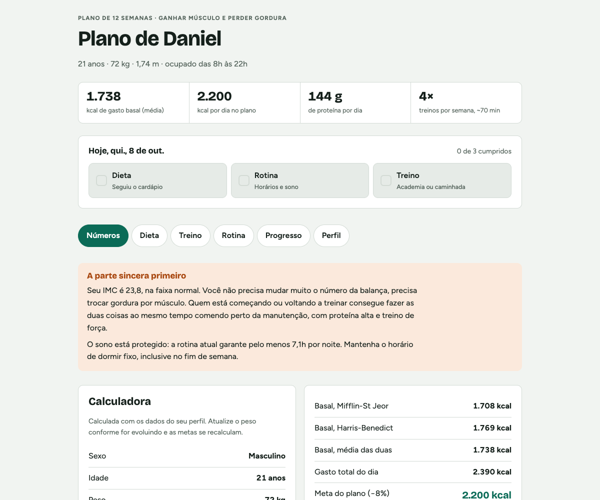
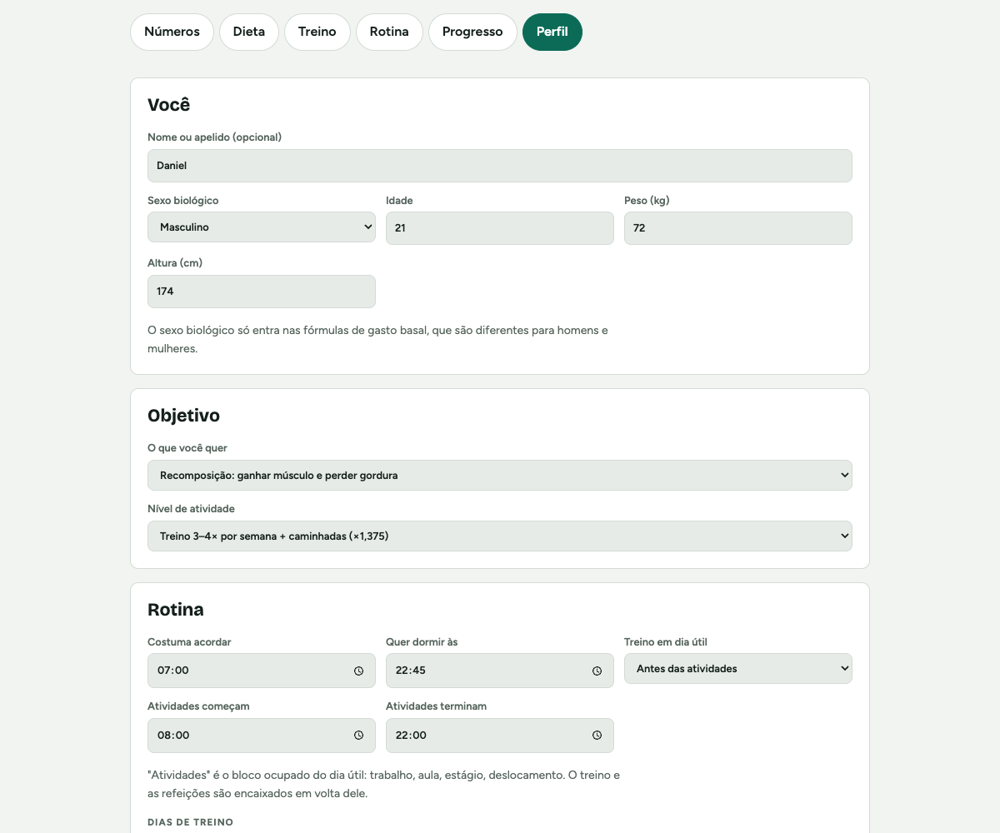
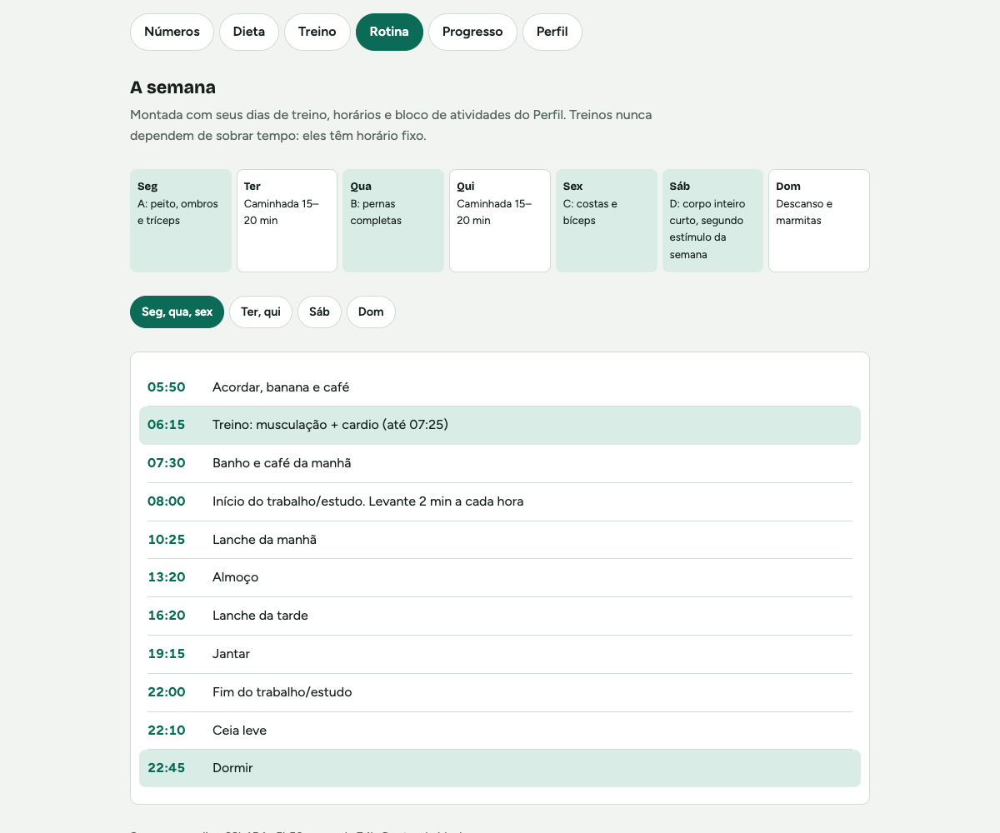
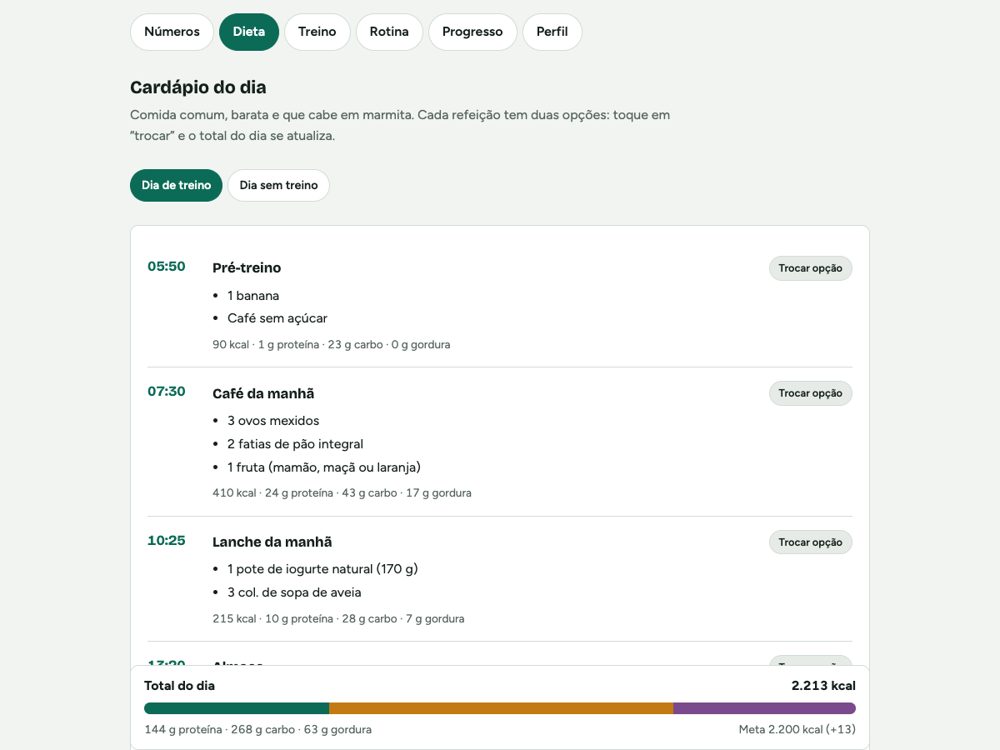
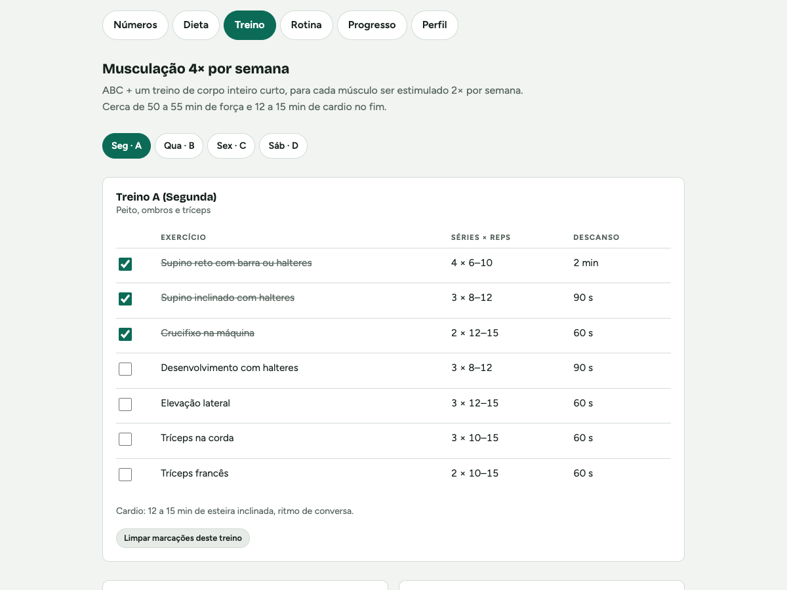
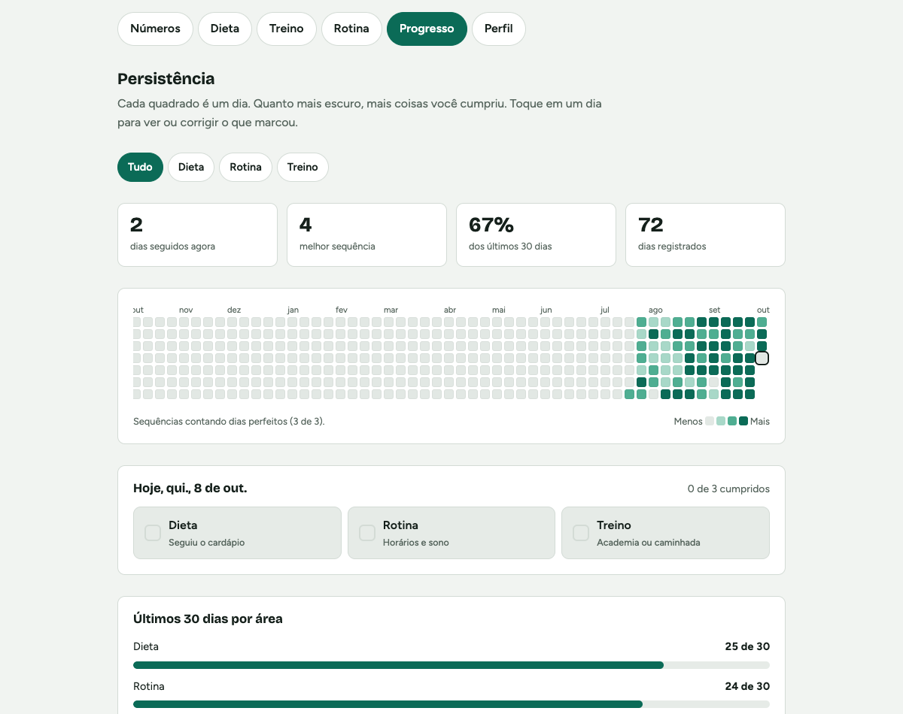
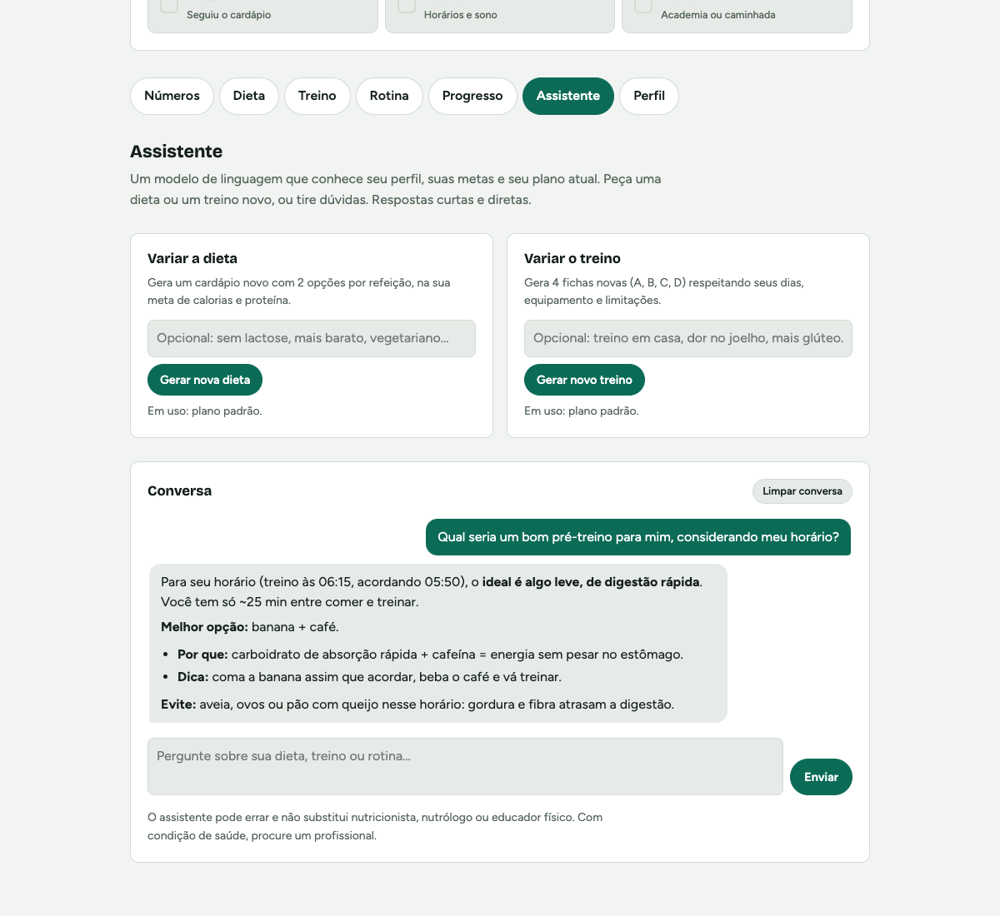
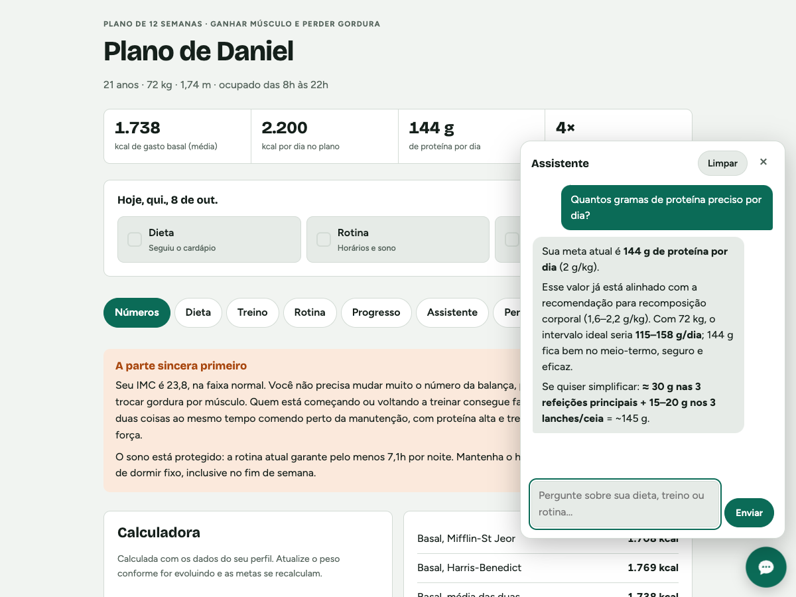
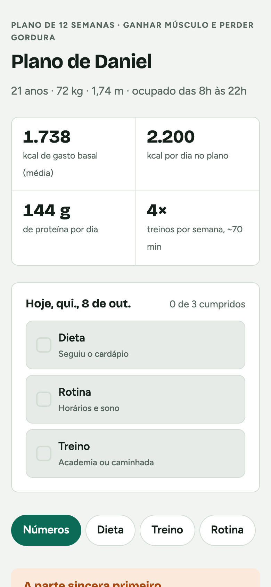
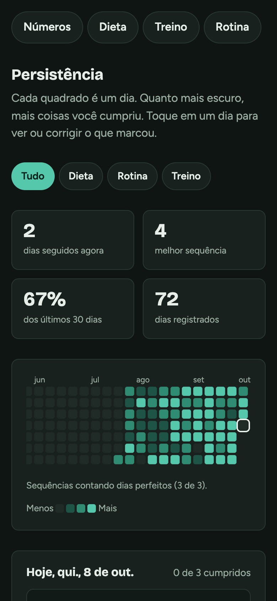

# RoutineSite

Um plano de 12 semanas de **dieta, treino e rotina** que se adapta a você, e um gráfico de constância para acompanhar se você está seguindo.

Você preenche seu perfil (idade, peso, altura, objetivo, horários e dias de treino) e o site monta metas de calorias e macros, um cardápio com horários, as fichas de musculação distribuídas na sua semana e a linha do tempo de cada dia. Todo dia você marca o que cumpriu e acompanha a evolução num gráfico estilo GitHub.

É só HTML, CSS e JavaScript: sem cadastro e sem instalar nada. Seus dados ficam no seu navegador. Opcionalmente, um **assistente com IA** (modelo Nemotron, da NVIDIA) gera variações da dieta e do treino e tira dúvidas sobre o seu plano.



## Para que serve

- **Começar ou voltar a treinar com um plano completo**, sem precisar montar dieta, treino e horários separadamente.
- **Encaixar o plano numa rotina apertada**: o treino, as refeições e o sono são distribuídos em volta do seu horário de trabalho/estudo.
- **Criar constância**: o check-in diário (dieta, rotina, treino) alimenta sequências, porcentagens e o mapa de dias.

## Funcionalidades

| Aba | O que faz |
| --- | --- |
| **Números** | Gasto basal (média de Mifflin-St Jeor e Harris-Benedict), gasto total, meta de calorias, IMC, água e macros. Textos de expectativa e ajuste mudam conforme o objetivo. |
| **Dieta** | Cardápio com 2 opções por refeição, horários calculados pela sua rotina, total do dia comparado à meta e aviso de quanto aumentar/diminuir as porções. |
| **Treino** | Fichas A, B, C e D distribuídas nos dias que você escolheu, com checkbox por exercício e dicas de progressão. |
| **Rotina** | Resumo da semana e linha do tempo de cada tipo de dia (treino, dia leve, fim de semana), com horas de sono e alertas. |
| **Progresso** | Mapa de persistência de 1 ano, sequência atual, melhor sequência, % dos últimos 30 dias e barras por área. |
| **Assistente** | Gera um cardápio novo ou fichas de treino novas sob medida (ex.: "sem lactose", "treino em casa") e conversa sobre o plano. A conversa também abre pelo **botão redondo no canto inferior direito**, em qualquer aba. Opcional (veja [Publicar](#publicar-github-pages--cloudflare-worker)). |
| **Perfil** | Seus dados e sua rotina. Tudo o que está acima se recalcula na hora. Também exporta, importa e apaga os dados. |

<table>
  <tr>
    <td></td>
    <td></td>
  </tr>
  <tr>
    <td></td>
    <td></td>
  </tr>
  <tr>
    <td></td>
    <td></td>
  </tr>
</table>

O chat flutuante acompanha você em qualquer aba:



Funciona bem no celular e respeita o tema claro/escuro do sistema:

<p>
  
  
</p>

## Como usar

Clone e abra o `index.html` no navegador:

```bash
git clone https://github.com/daniellealpimenta/RoutineSite.git
cd RoutineSite
open index.html        # macOS (no Windows: start index.html)
```

Se preferir servir por HTTP (recomendado para celular na mesma rede):

```bash
python3 -m http.server 8000
# acesse http://localhost:8000
```

No primeiro acesso o site abre na aba **Perfil** com valores de exemplo. Troque pelos seus e pronto.

### Com o assistente de IA, no seu computador

O assistente precisa de um servidor que guarde a chave da API, para ela nunca ir para o navegador. Para rodar local, o projeto já traz um (`server.js`, Node 18+, sem dependências). Para deixar no ar sem computador ligado, veja [Publicar](#publicar-github-pages--cloudflare-worker).

1. Pegue uma chave gratuita em [build.nvidia.com](https://build.nvidia.com) ("Get API Key").
2. Copie `.env.example` para `.env` e cole a chave em `NVIDIA_API_KEY`.
3. Rode e acesse `http://localhost:8000`:

```bash
node server.js
```

Sem o servidor, a aba Assistente mostra como ligá-lo e o resto do site funciona igual.

## Publicar (GitHub Pages + Cloudflare Worker)

O GitHub Actions não mantém servidores no ar: ele só roda tarefas que começam e terminam. Por isso a publicação tem duas partes, e o Actions cuida das duas a cada `git push`:

| Parte | Onde roda | Workflow |
| --- | --- | --- |
| Site (HTML/CSS/JS) | GitHub Pages | [`.github/workflows/site.yml`](.github/workflows/site.yml) |
| Proxy do assistente, que guarda a chave | Cloudflare Workers (plano grátis: 100 mil pedidos/dia) | [`.github/workflows/assistente.yml`](.github/workflows/assistente.yml) |

**Por que não deixar a chave no próprio site?** Tudo o que está no site (e no repositório público) pode ser lido por qualquer pessoa, e robôs procuram chaves no GitHub o tempo todo. O modelo é aberto, mas a chave é da **sua conta** na NVIDIA: quem a pegar usa sua cota e seus limites para qualquer coisa, e pode fazer a conta ser bloqueada. O Worker guarda a chave, fixa o modelo e os limites e controla quanto cada pessoa (e todo mundo junto) pode usar por dia. Veja [Proteção contra abuso](#proteção-contra-abuso).

### Passo a passo (uma vez só)

1. **GitHub Pages:** no repositório, *Settings → Pages → Build and deployment → Source:* **GitHub Actions**.
2. **Cloudflare:** crie uma conta grátis em [dash.cloudflare.com](https://dash.cloudflare.com).
   - Copie o **Account ID** (aparece na página *Workers & Pages*).
   - Crie um token em *My Profile → API Tokens → Create Token →* modelo **Edit Cloudflare Workers**.
3. **Secrets no GitHub** (*Settings → Secrets and variables → Actions → Secrets*):
   - `CLOUDFLARE_API_TOKEN`: o token do passo 2
   - `CLOUDFLARE_ACCOUNT_ID`: o Account ID
   - `NVIDIA_API_KEY`: sua chave da NVIDIA
4. Rode o workflow **Publicar assistente** (*Actions → Publicar assistente → Run workflow*). No log aparece o endereço do Worker, algo como `https://routinesite-assistente.SEU-USUARIO.workers.dev`.
5. **Variável no GitHub** (*Settings → Secrets and variables → Actions → Variables*): crie `ASSISTENTE_URL` com esse endereço.
6. Rode o workflow **Publicar site** (ou faça um push). O site fica em `https://daniellealpimenta.github.io/RoutineSite/` com o assistente funcionando.

Depois disso, cada push na `main` republica o site e, se `api/` ou `wrangler.toml` mudarem, o Worker também.

Se publicar o site em outro endereço (domínio próprio, fork), adicione-o em `ORIGENS_PERMITIDAS` no [`wrangler.toml`](wrangler.toml). Sem isso, o Worker recusa os pedidos.

### Proteção contra abuso

O endereço do Worker é público, então alguém mal-intencionado pode tentar disparar milhares de pedidos para gastar sua cota da NVIDIA ou derrubar o assistente. As defesas, da mais barata para a mais cara:

| Camada | O que barra |
| --- | --- |
| Filtros na entrada | Método, rota, `Content-Type`, tamanho (120 KB) e origem errados são recusados antes de qualquer outro trabalho. Pedidos sem origem do seu site (curl, scripts, outros sites) recebem 403. |
| Validação | Só mensagens no formato do app: até 30 mensagens, 60 mil caracteres, terminando em pergunta do usuário. O modelo, o tamanho da resposta e o tempo máximo (2 min) são fixos no servidor. |
| Cotas (Durable Object) | Contador único e consistente, mesmo com milhares de pedidos chegando juntos. Por pessoa: 6 pedidos/min, 60 pontos/dia e 2 respostas em andamento. **Teto global de 600 pontos/dia**, somando todo mundo: o máximo que a chave pode gastar, mesmo contra robôs com muitos IPs. Conversa vale 1 ponto, gerar dieta ou treino vale 4. |
| Turnstile (opcional) | Captcha invisível e grátis da Cloudflare. Prova que é uma pessoa antes de liberar uma sessão assinada de 2 h, com cota própria. Com ele, um robô não consegue só trocar de IP: precisa resolver um desafio por sessão, e cada IP pode abrir no máximo 20 sessões por dia. |
| No navegador | Content Security Policy (só scripts do próprio site e do Turnstile; o site publicado só conversa com o Worker) e todo texto do modelo escapado antes de ir para a tela. |

Os limites ficam no [`wrangler.toml`](wrangler.toml) (`LIMITE_*`): mude e faça push. O IP não é guardado, só um hash dele, e os contadores zeram todo dia à meia-noite UTC. O `server.js` local aplica as mesmas cotas, em memória.

**Ligar o Turnstile (recomendado):**
1. No painel da Cloudflare: *Turnstile → Add widget*. Em *hostnames*, coloque `daniellealpimenta.github.io` (e `localhost` para testar). Modo **Managed**.
2. No GitHub: crie a variável `TURNSTILE_SITE_KEY` (chave pública) e o secret `TURNSTILE_SECRET` (chave secreta).
3. Rode **Publicar assistente**. O site detecta sozinho e passa a pedir a verificação, que quase sempre é invisível.

**O que o código não consegue impedir, e por que não é grave:**
- **Cota de pedidos do Cloudflare.** No plano grátis, todo pedido ao Worker conta nos 100 mil/dia, inclusive os recusados. Um ataque grande pode esgotar essa cota, mas **no plano grátis isso não gera cobrança**: o Worker só para de responder até a meia-noite UTC, e o resto do site (GitHub Pages) continua no ar. Não mude para o plano pago sem configurar alertas de uso (*Notifications → Usage-based billing*).
- **Robôs com muitos IPs resolvendo captchas.** O teto global limita o estrago a 600 pontos/dia: no pior caso, o assistente fica indisponível até o dia seguinte.
- Para barrar ataques antes de chegarem ao Worker (sem contar na cota), dá para usar um domínio próprio na Cloudflare com uma regra de **WAF Rate Limiting** (o plano grátis inclui 1 regra).

## Personalização

Tudo é configurado pela aba **Perfil**:

| Campo | Afeta |
| --- | --- |
| Sexo, idade, peso, altura | Gasto basal, meta de calorias, proteína, IMC, água |
| Objetivo: perder gordura (−15%), recomposição (−8%) ou ganhar massa (+10%) | Meta de calorias, proteína por kg, textos de expectativa e de ajuste |
| Nível de atividade | Multiplicador do gasto total |
| Horário de acordar e de dormir | Linha do tempo, horas de sono, horário das refeições |
| Início e fim das atividades (trabalho, aula...) | Onde o treino e as refeições se encaixam |
| Treino antes ou depois das atividades | Horário do treino em dia útil (antes = acordar mais cedo) |
| Dias de treino | Divisão das fichas: 1–2 dias = corpo inteiro, 3 = ABC, 4+ = ABCD |
| Sobre sua rotina | Texto livre que aparece como lembrete na aba Rotina |

Quer mudar o conteúdo do plano em si? Ele está em arquivos simples de dados:

- Cardápio: [`src/domain/plano/refeicoes.js`](src/domain/plano/refeicoes.js)
- Fichas de treino: [`src/domain/plano/treinos.js`](src/domain/plano/treinos.js)
- Objetivos e níveis de atividade: [`src/domain/perfil.js`](src/domain/perfil.js)

## Assistente de IA

O assistente usa o modelo [`nvidia/nemotron-3-ultra-550b-a55b`](https://build.nvidia.com) pela API da NVIDIA, compatível com a da OpenAI. Ele atua como nutricionista esportivo e educador físico, com respostas curtas e em linguagem simples.

- **Variar a dieta:** pede um cardápio de 7 refeições, com 2 opções cada, na sua meta de calorias e proteína. A resposta vem em JSON, é validada e substitui o cardápio na aba Dieta. Os horários continuam vindo da sua rotina.
- **Variar o treino:** pede 4 fichas novas (A empurrar, B pernas, C puxar, D corpo inteiro), que entram nos seus dias de treino.
- **Voltar ao padrão** a qualquer momento, na aba Assistente.
- **Conversa:** perguntas livres ("o que comer antes do treino?", "troque o almoço por algo sem carne").

**Como o contexto funciona.** O modelo não guarda memória entre chamadas: cada pedido é independente. Por isso o site manda em cada um o seu perfil, as metas, a rotina e o plano atual, mais as últimas 12 mensagens da conversa. O limite de contexto do modelo vale para cada pedido, não para a conversa toda. Mensagens antigas só deixam de ser enviadas e continuam visíveis na tela.

**Privacidade.** Ao usar o assistente, esses dados (incluindo o texto "Sobre sua rotina") são enviados para a API da NVIDIA. Sem usar o assistente, nada sai do navegador.

**Configuração do servidor local (`.env`):** `NVIDIA_API_KEY` (obrigatória), `NVIDIA_MODEL`, `PORT` (padrão 8000) e `HOST` (padrão `127.0.0.1`). Com `HOST=0.0.0.0` dá para abrir no celular pela rede local, mas qualquer pessoa na rede passa a usar sua chave.

## Onde ficam os dados

Tudo é salvo no **`localStorage` do navegador**, com chaves que começam com `rd-` (perfil, check-ins, escolhas do cardápio, exercícios marcados, planos gerados pelo assistente e a conversa). Isso significa que:

- nada é enviado para servidor nenhum, exceto o que vai para a IA quando você usa o assistente;
- os dados continuam lá quando você fecha e abre o site;
- cada navegador/aparelho tem os seus próprios dados, e limpar os dados do site apaga tudo.

Para levar seus dados para outro aparelho ou guardar uma cópia, use **Perfil → Exportar backup** (gera um `.json`) e depois **Importar backup** no outro navegador.

## Arquitetura

Sem framework e sem build. Os scripts são carregados em ordem no `index.html`, de dentro para fora, e cada camada só usa as anteriores:

```
src/
├── shared/         utilitários sem regra de negócio (datas, formatação)
├── domain/         o plano e as regras, em funções puras
│   ├── perfil.js     perfil padrão, objetivos, validação
│   ├── plano/        dados: refeições, treinos, categorias do check-in
│   └── regras/       calculadora, cardápio, progresso, rotina, prompts e validação da IA
├── data/           localStorage, repositórios e a chamada ao assistente (api/)
├── application/    casos de uso: o que o usuário pode fazer
├── presentation/   telas, componentes (inclui o chat flutuante), navegação e CSS
├── config.js       endereço do assistente (o workflow do Pages preenche)
└── main.js         liga tudo
api/
├── nucleo.mjs      validação, cotas e chamada ao modelo, compartilhadas pelos dois abaixo
└── worker.mjs      proxy no Cloudflare Workers (produção), com Durable Object de cotas e Turnstile
server.js           proxy + site no seu computador (desenvolvimento)
wrangler.toml       configuração do Worker
.github/workflows/  publicação automática do site e do Worker
```

Trocar o `localStorage` por uma API, por exemplo, só mexe em `src/data/`.

## Aviso

O assistente de IA pode errar. As fórmulas dão estimativas com margem de uns 10%, e o plano é um ponto de partida genérico, não uma prescrição. Se você tem alguma condição de saúde, toma medicação, está grávida ou tem histórico de transtorno alimentar, passe o plano por um médico ou nutricionista antes.

## Licença

Distribuído sob a licença MIT. Veja [`LICENSE`](LICENSE).
